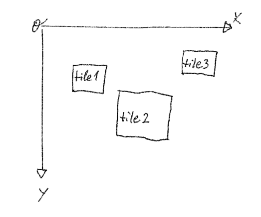
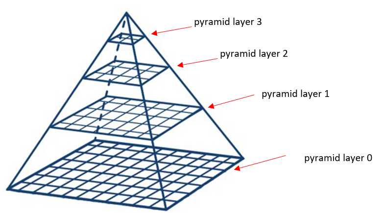
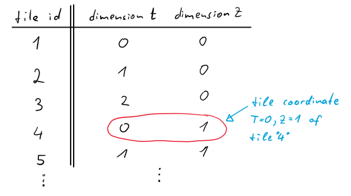

# document concept               {#document_concept}

The concept of a "document" in the context of libimgdoc2 is discussed here.

## DocumentType

At the top level, the concept is that a document (represented by the IDoc-interface) is of a certain type,
as represented by the enum DocumentType. General speaking, different types of documents can have different 
ways of interacting with them and be different in their concepts. They are therefore represented
by different interfaces.

As a general rule, interfaces for "read-only access" and "write access" are strictly separated.

For the time being, two document types are implemented:
* Image2d
* Image3d

## Image2D

As far as the persistence layer is concerned, the functionality provided here is:

* storage of blob data (containing the pixel information of a tile)
* a tile is a rectangular and axis-aligned image, and it is described by information describing its bitmap-content 
   (width/height/pixeltype), its logical position, its pyramid-level and a _coordinate_
* the document can be queried for tiles with certain conditions (including spatial queries)

The term coordinate refers to the following concept: a document can have an arbitrary number of dimensions
associated with a coordinate, and a tile is associated with a specific value for those dimensions.
The dimensions are to be chosen so that grouping the tiles can be done as appropriate.

All tiles within one document share the same coordinate system (refered to as the _pixel coordinate system_), as shown here:

Every tile comes with the following mandatory geometric information:

* the X- and Y-coordinate of the top-right corner of the tile (in _pixel coordinate system_)
* the width and the height of the tile (in _pixel coordinate system_)
* the pyramid layer

It is important to note that width and height in this context is **not** the same as the width/height in pixels of the tile. The width
and height is conceptually only refering to the _pixel coordinate system_ and states the extent of the tile in it - independent of the actual
pixel width and height. It is also called the _logical width and height_.

### pyramid layer

The concept of has the purpose of including minified bitmaps. The availability of a suitable minification is essential for many image​
processing operations and in particular for a zoom- and panable viewer.
Pyramid layers are counted as shown here:

For tiles on a pyramid layer other than 0, they have a logical size different to their size in pixels. So, upper pyramid layers are sub-sampled
(compared to the layer below), but their _logical width and height_ is given "as if they would be enlarged" so that they have same resolution as
tiles on layer 0.

Tiles in pyramid layers *must* have the same "image content" as the layers below. They may not contain image content of a different specimen, different
modality or such.

### tile coordinates

With term _tile coordinate_ we refer to the following: associated with each tile there is a set of integers, and each of those integers gives the position
in a _dimension_. Essentially, we have a table like e.g. this:

The set of dimensions is global for the document. There is no semantic associated with a dimension as far as the storage layer is concerned.

